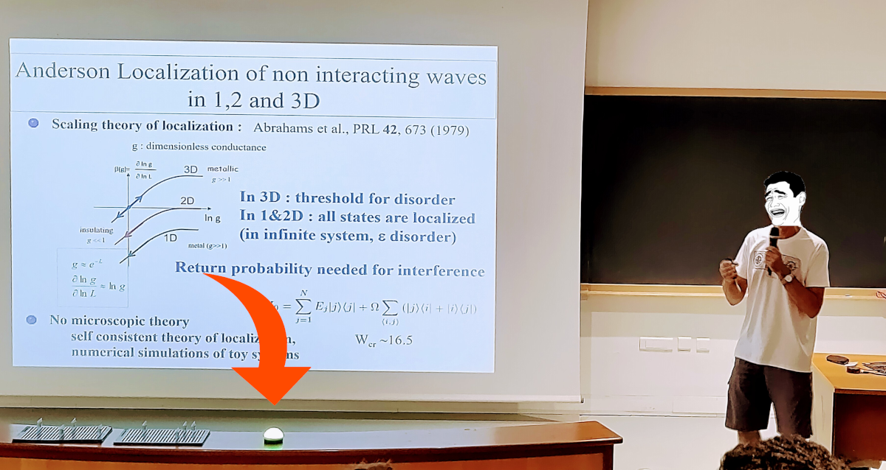
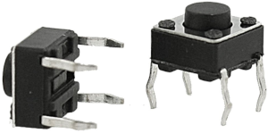

Color Time
==========
## *A passive-agressive tool to tell the speaker it is time to stop talking*

    

## Table of Content
1. [What is it?](#what)
2. [How does it work?](#how)
3. [Build it](#build)
4. [Usage](#usage)
5. [Credits](#credits)

## 1. What is it? 
During scientific talks it is sometimes difficult, or awkward, for the chairmen to warn speakers that they are exceeding their allotted time.
We developed a device, 
designed to be placed between the speaker and the audience, 
that indicates using a color coded light how much time they have left. 
It also signals the time for question and the end of the allotted time with color flashes.

## 2. How does it work? 

Once started and set up, the light of the device will gradually change from green to red during the time of the talk. 
It will also signal the time for questions with few red flashes and then will flash blue and red at the end of the talk to tell the speaker and chairman that the time is up. 

The device can be controlled using a push button by directly pressing on the device and/or using bluetooth with a smartphone.

## 3. Build it 
### 3.1 Bill of materials
* 1x Raspberry Pi Pico
* 1. 6x6x4.5mm push button
* 1x 61-LED [[buy](https://www.amazon.fr/gp/product/B07L7ZPPV9/ref=ppx_yo_dt_b_asin_title_o00_s00?ie=UTF8&psc=1)] [[instructions](https://www.make-it.ca/ws2812-neopixel-ring-to-attiny85/)]
* 1x HC-05 (or HC-06) Bluetooth board [Optional]
* White and black (or colored) PLA for 3d printed parts

### 3.2 3d-printed parts

150 micron resolution is good enough. 
For the top part, use can use a translucent plastic but using white is good enough as light will still go through given the thickness of the shell.

### 3.3 Assembly

### 3.4 Button

Solder the two pins of the button, one to a `GND` pin of the board, the other to pin `GP9`.
Be careful to pass the wire through the hole before soldering them the the board.

Then, push the button into the designated hole. 
Ideally, make it so the button sticks out a little bit. 
This way, you can press directly on the white dome to press the button. 

### 3.5 LEDs
Simply follow the tutorial [here](https://www.make-it.ca/ws2812-neopixel-ring-to-attiny85/) for soldering the different rings. 
Then solder the `DI` digital input to `GP20`. Use `VBUS` (usb power) for `Vcc` and any `GND` pin for ground.

### 3.6 Blueooth [optional]

Once every thing soldered, place the Pico board so that the 
micro-usb socket is properly in place. 
You should be able to plug a power cord without moving the board.
You can keep the Pico in place with one drop of glue gun in the corners of the board.

Place a piece of paper (to prevent short circuit) on top of the Pico board and put the HC-05 on top of it.

### 3.7 Final assembly

Use a glue gun to keep the LEDs in place and final snap the top white dome onto the base. 
And you are done!

## 4. Usage

### 4.1 Preparation
If you intend to use the device without bluetooth, 
you need to set up few parameters in the code. 
However, you could make it work out of the box with just editing 
`state_time` to fit the duration of the talks.

* `state_time`: the list of different time for talks in minutes. 
  **Do not edit the first one** as it correspond to the demo of a duration of 20 seconds and for which the time for question is modified to be equal to 10 seconde, regardless of the value of `T_QUESTION`
* `state_colors`: list of colors for the different times. 
  Each color should be a list or tuple of three integers between 0 and 255. 
  This list should be of the same length as `state_time`
* `T_QUESTION`: time allotted for question. 
  The device will flash red for 4 seconds `T_QUESTION` minutes before the end of the talk.
* `BRIGHTNESS_MIN`: brightness at the beginning of the countdown.
* `BRIGHTNESS_MAX`:  brightness at the END of the countdown.
* `BRIGHTNESS_FLASH`: brightness for the flashes for the question signal and the end of the talk.
  
### 4.2 Power source

Plug the device to any power source using a micro-USB cable. 
A small power bank is typically enough for hours of usage.

### 4.3 Button commands

* `Single press`: switch to the next state (duration of talk) and start the count down.
* `Double press`: pause the countdown without stopping it. 
  `Single press` again to resume.
* `Long press`: stop the countdown and switch of the LEDs. 

### 4.4 Bluetooth communication

Communication is done using ASCII text message over a serial protocol. 

#### Commands
Commands are the following:
* `START`: start the countdown,
* `PAUSE`: pause the countdown, 
* `RESUME`: resume the countdown after pause,
* `STOP`: stop the countdown and switch of the LEDs
* `T{X}`: specify the time (in minutes) for a countdown and starts it, 
for instance `T20` sets a countdown for a 20-minute talk,
* `C{X}`: change the remaining time to `X` minutes.

#### Android phone

Download and install [Serial Bluetooth Terminal](https://play.google.com/store/apps/details?id=de.kai_morich.serial_bluetooth_terminal). 
Use the serial terminal to send commands or use buttons. 
To configure a button, long press on it, give it a name and set the commands. This is how it looks like:

Additionally, the device will send information about the time left before the questions and before the end of the talk.

## Credits

* Idea: Fabrice Lemoult
* Design: Sébastien M. Popoff
* Tests: Sébastien M. Popoff, Romain Pierrat, and F. Lemoult